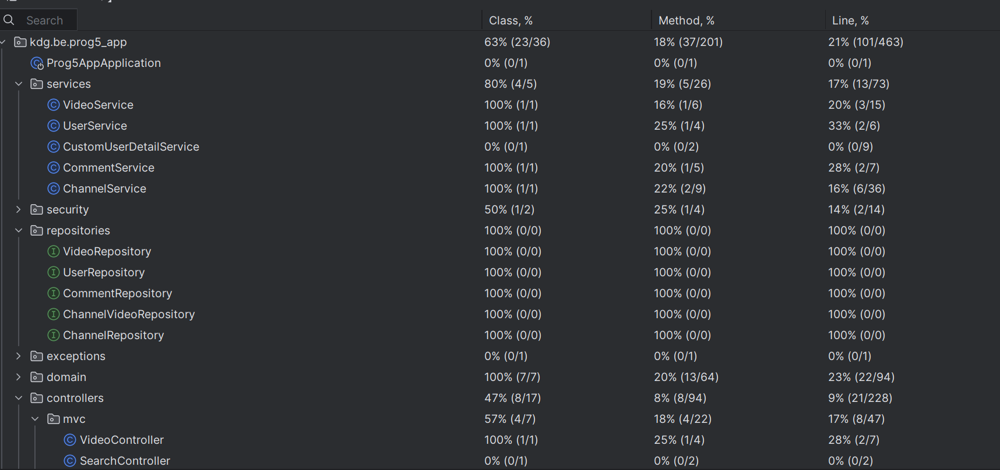
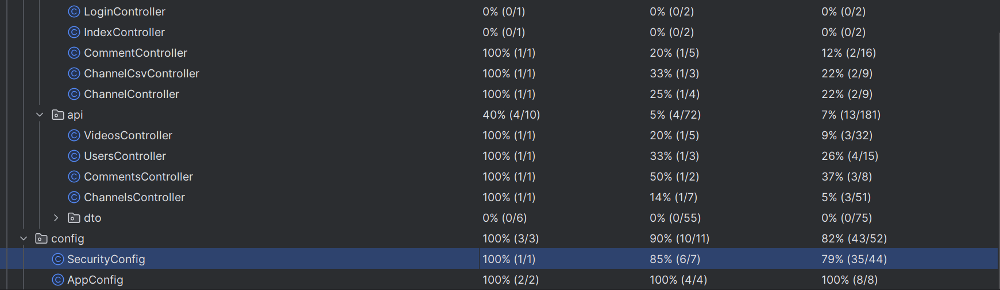

# Programming 5

## Video Platform Application

### Author

> Anna Deineko

> Group: ACS 202

> anna.deineko@student.kdg.be

### About

This is an application where you can manage data about your channels like videos, comments and other necessary
information.

### Domain

> videos - comments: one to many
>
> videos - channels: many to many
>

### Build&Run instructions

1. Start docker:

> docker compose --profile "*" up -d

2. Generate jar file:

> ./gradlew build

3. Run the application:

> java -jar build/libs/prog5_app-0.0.1-SNAPSHOT.jar fully.qualified.package.Application

4. Run tests:

> ./gradlew clean test --info

### Week 2

**API: retrieve 1 channel**
> Request (success)
>
>`GET http://localhost:8080/api/channels/1`
>
> Response
>
>`HTTP/1.1 200
Content-Type: application/json
Transfer-Encoding: chunked
Date: Fri, 01 Mar 2024 14:12:25 GMT
Keep-Alive: timeout=60
Connection: keep-alive`
>
> Request (not found)
>
> `GET http://localhost:8080/api/channels/90`
>
> Response
>
> `HTTP/1.1 404
Content-Length: 0
Date: Fri, 01 Mar 2024 14:16:27 GMT
Keep-Alive: timeout=60
Connection: keep-alive`
>
**API: delete a channel**
> Request (deleted)
>
>`DELETE http://localhost:8080/api/channels/2`
>
> Response
>
>`HTTP/1.1 204
Date: Fri, 01 Mar 2024 14:18:46 GMT
Keep-Alive: timeout=60
Connection: keep-alive`
>
> Request (not found)
>
> `DELETE http://localhost:8080/api/channels/90`
>
> Response
>
> `HTTP/1.1 404
Content-Length: 0
Date: Fri, 01 Mar 2024 14:19:51 GMT
Keep-Alive: timeout=60
Connection: keep-alive`
>

### Week 3

**API: Creating a channel (successfully)**
> Request
>
> `POST http://localhost:8080/api/channels
Accept: application/json
Content-Type: application/json
{
"name": "The name",
"date": "2024-03-11",
"subscribers": 345
}`
>
> Response
>
> `HTTP/1.1 201`
> {
"id": 3,
"name": "The name",
"date": "2024-03-11",
"subscribers": 345
> }
> Response file saved.
>
**API: Update channel**
> Request
>
>`PATCH http://localhost:8080/api/channels/1
Content-Type: application/json
{
"name": "Channel",
"subscribers": 654
}`
>
> Response
>
> `HTTP/1.1 204`
> Response body is empty Response code: 204;
>
>
**API: retrieve one channel XML format**
> Request
>
>`GET http://localhost:8080/api/channels/1
> Accept: application/xml`
>
> Response
>
> `GET http://localhost:8080/api/channels/1
HTTP/1.1 200
<ChannelDto>
<id>1</id>
<name>Channel</name>
<date>2022-09-04</date>
<subscribers>654</subscribers>
</ChannelDto>
Response file saved.
> 2024-03-15T175733.200.xml`

### Week 4

**List of users:**
> Username: anna
>
>Password: anna - ADMIN

> Username: alex
>
>Password: alex - ADMIN

> Username: walter
>
>Password: walter - REGULAR USER

> Page that can be accessed by anyone
> `http://localhost:8080/channels`

> Page that requires authentication to be accessible
> `http://localhost:8080/channels/1`

### Week 5

> **Unauthenticated users**
>
> Can see  list of channels and Videos with its details,
> no comments. Cannot access details about channels/comments
>Cannot add channels, comments. Cannot delete anything
> 
> **Authenticated user**
>
> Can access Channels, Comments, Videos and detailed pages of it, but cannot add/update/delete
>
> **Admin**
>
> Authenticated user + ability to add, delete, update

### Week 6

>
> **Profiles**
>
> dev profile - used for development, set as environment variable
>
> test profile - used for testing

### Week 7

> **MVC Tests**
>
> controllers/mvc/ChannelsControllerTest class

> **API Tests**
>
> controllers/api/ChannelsControllerTest class

> **Role verification tests**
>
> controllers/api/ChannelsControllerUnitTest
> 
### Week 8
**Code coverage**

### Week 11
**Bootstrap icon**
>[Video page](http://localhost:8080/videos) - Add video button
>[Source file](src/main/resources/templates/video/AddVideos.html)

**Client-side validation**
>[Add channel](http://localhost:8080/videos/add)
>
> [Source file](src/main/js/addChannel.js)

**JavaScript dependencies**
>Install three.js - run from the command line `npm i three`
>[Source file](src/main/js/main.js)
> 
> Install TypeScript - run from the command line `npm install typescript --save-dev`
>Than run TS compiler `tsc -w`
> [Source file](script/comments.ts)

>[Three.js](http://localhost:8080/)
> 
> [Typescript](http://localhost:8080/comments)

### Week 12
[Test report](https://gitlab.com/kdg-ti/programming-5/projects-23-24/acs202/anna.deineko/programming-5/-/pipelines/1307578152/test_report?job_name=test)